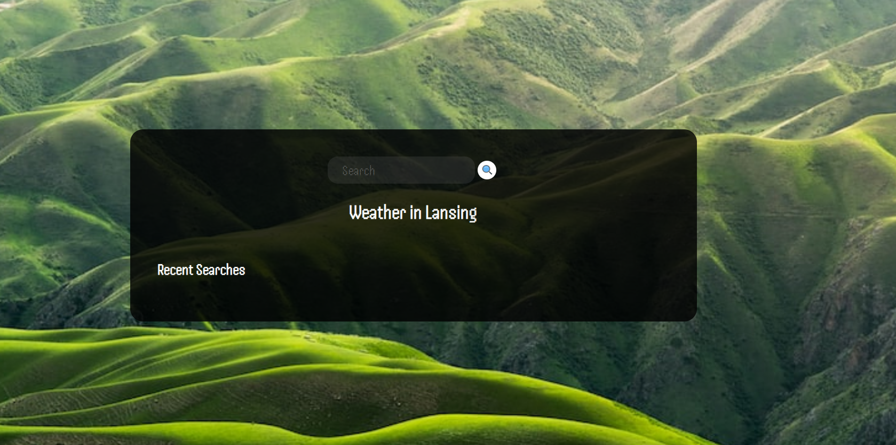
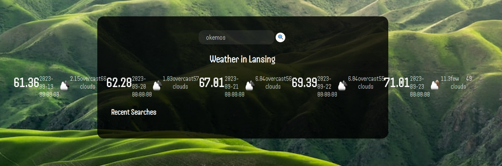

# <Your-Project-Title>

## Description

The Weather Possum is web app that is used to get the local weather forecast for a local city 

- you can search any city or zipcode and it will display the weather for the current time and 5 days in the future
- in addition the app will be designed to save your recent searches locally so at the click of a button you can recall cities you've searched
- there is a dynamic background that changes on each load
## Table of Contents

- [Installation](#installation)
- [Usage](#usage)
- [Still to do](#Still_to_do)

## Installation

no installation is required, just load the webpage and you're good to go.

## Usage

Upon load you are presented with a blank screen

you can fill out the search box with a city or a zipcode and it will return the results of the weather

## Still to do

I'm still working on this app and still have several features to incorporate

-Incorporate local storage and create the ability to click on a recent search and load those results
-Work with the css to make all the weather information appear on its own card on the scree
-Get the local weather displayed on load of the web app
-Have the "Weather in Lansing" banner change dynamically with the city queried

